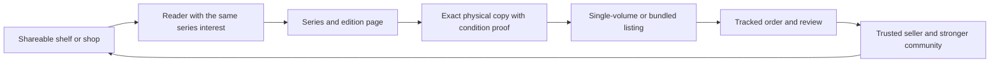

# MangaMarketplace product and header research

Research date: August 24, 2026

## Product position

MangaMarketplace should not try to beat Amazon, Barnes & Noble, or Kinokuniya at being a general retailer. Their advantages are catalog size, retail inventory, fulfillment, discounts, exclusive editions, and established search. The stronger product is a focused, community-powered marketplace for the *specific physical copy* a reader owns or needs.

The core promise is:

> Sell the copies you own. Buy the exact manga you want.

That promise joins three jobs that broad retailers separate:

1. Find an exact series volume, language, format, or printing.
2. Judge the condition of the actual secondhand copy before buying it.
3. Discover and share with collectors, readers, students, sellers, and traders who have overlapping interests.

## Competitor and pattern review

| Product | What its current experience emphasizes | What MangaMarketplace should learn | Opportunity for this app |
| --- | --- | --- | --- |
| Amazon | Huge catalog, ISBN-backed offers, competitive pricing, multiple fulfillment paths, and formal book-condition grades | Keep catalog records separate from the condition and price of an individual copy | Make series, volume, edition, language, and real-copy photos easier to understand than a generic offer list |
| Barnes & Noble | A dense retail header with a promotional strip, global search by title/author/keyword/ISBN, membership, category navigation, wishlist, and cart | Search deserves top-level prominence; ISBN is a useful edition-finding path | Replace retailer promotions with community value and never advertise a shipping offer that peer sellers cannot guarantee |
| Kinokuniya USA | Curated English/Japanese books, trending manga, new releases, exclusives, collaborations, staff picks, stores, events, and membership | Manga culture, language, editorial curation, and physical community events create identity | Add bilingual/edition filters and community curation without pretending to hold first-party inventory |
| PangoBooks | Reader-to-reader selling, search across titles/authors/sellers/series, barcode/ISBN listing, actual-copy photos, personal shops, prepaid labels, and shareable bookstore links | A low-friction listing flow and a seller identity make resale feel social | Go deeper on manga: missing-volume tracking, series completion, print/edition precision, sets, wish lists, and collector circles |
| eBay and Mercari | General resale, seller photos, condition disclosure, offers, bundles, shipping choices, and seller tools | Trust depends on honest specifics, visible flaws, shipping clarity, and platform communication | Use a manga-specific listing form and catalog so casual sellers do less work while buyers get more certainty |

## Header decision

The implemented header uses two connected grids:

- The site-navigation grid keeps the brand, marketplace navigation, multi-field search, and account tools readable without copying a big-box retailer.
- The page-header grid leads with the buy-and-sell promise, then demonstrates the main collector problem through a missing-volume shelf. Three paths explain search, copy-level proof, and sharing.

The earlier generic message about “new and second-hand” was removed. It described inventory, but not why this application deserves to exist. The replacement advertises the differentiators supported by the intended use cases:

- exact-volume and edition discovery;
- seller photos and condition notes;
- individual volumes and multi-volume sets;
- shareable shelves, shops, and wish lists;
- community formation around overlapping series and interests.

The unsupported “Free U.S. shipping on orders over $50” message was also replaced. In a peer marketplace, shipping cost and eligibility depend on the item, package, seller choice, and carrier rules.

## Recommended product sequence

### Phase 1: make each copy trustworthy

- Use `CatalogProduct` for edition-level facts: title, series, volume number, ISBN, language, publisher, format, and printing/edition.
- Use `InventoryItem` for the actual copy: owner, condition grade, structured flaws, notes, and required real-copy photos.
- Use `Listing` and `ListingItem` for price, status, seller, and single-volume or multi-volume bundles.
- Standardize condition grades, but also require photo prompts for cover, spine, page edges, back, and disclosed damage.
- Add seller profiles, transaction ratings, reporting, moderation, and on-platform communication before marketing the product as a community.

### Phase 2: make series completion the discovery engine

- Let readers track owned, wanted, reading, and for-sale volumes by series.
- Create saved searches and alerts for exact volume, ISBN, language, edition, condition, and price.
- Show compatible sets and seller bundles when they fill multiple shelf gaps.
- Make public shelves, shops, wish lists, and listing URLs easy to share with a small trusted community.

### Phase 3: strengthen community without harming marketplace trust

- Follow collectors, series, shops, and curated lists—not only products.
- Add spoiler-safe discussion spaces, recommendations, local events, and themed collections.
- Keep payment, identity, and transaction messaging on-platform; provide block/report controls and visible community standards.
- Use privacy-preserving region labels if local discovery is added. Do not expose a precise home location.

## Technical opinion

The current four-entity backend direction is a sound foundation because it separates a title/edition from a particular owned copy and separates ownership from a sale offer. That is the right model for manga, where two copies with the same story may differ by ISBN, language, printing, trim, cover, included extras, and physical condition.

The main competitive advantage should be a series-and-edition graph on top of that transactional core. Amazon and Barnes & Noble are optimized to sell a known product; Kinokuniya is optimized to curate and retail Japanese media; eBay and Mercari can resell nearly anything; PangoBooks makes general used-book selling friendly. MangaMarketplace can be the place that understands *why Volume 3, this printing, in this language, from a trusted fan* matters.

The community loop should work like this:



## Shipping constraint to design now

Do not model every book-adjacent product as Media Mail eligible. USPS states that Media Mail packages may not contain advertising and that comic books do not meet its standard. Magazines, single comic issues, manga merchandise, décor, and mixed bundles may require another service. The listing and checkout model should store a shipping-eligibility class and validate the entire bundle before quoting a label.

## Fluid type and spacing system

The interface uses calculated `clamp()` tokens in `app/globals.css` rather than independent viewport-unit guesses. Each preferred value is a linear interpolation between a `20rem` viewport and an `80rem` viewport:

```css
clamp(minimum, calc(intercept + slope * 1vw), maximum)
```

This gives text and whitespace a controlled relationship: both grow continuously, both stop at intentional minimum and maximum values, and components consume the same scale. The display headline has its own token because it needs more range than ordinary headings; the second sentence remains `0.72em` so its hierarchy always stays proportional to the first sentence. Zero values, automatic centering margins, and character-based line lengths remain relational exceptions rather than being forced into a viewport formula.

The marketplace headline stays left-aligned and is limited to `12ch`. That treatment supports fast commerce-oriented scanning and creates a stable edge for the eyebrow, description, and calls to action. Centering would make the area feel more like a brand campaign or social-community invitation, while an unlimited measure would weaken the contrast between the two promises.

## Sources

- [Amazon: How to sell new and used books online](https://sell.amazon.com/learn/how-to-sell-books)
- [Amazon: Book and product condition guidelines](https://sell.amazon.com/blog/amazon-condition-guidelines)
- [Barnes & Noble: Graphic novels and comic books](https://www.barnesandnoble.com/collections/books/graphic-novels-comics)
- [Barnes & Noble: Premium and Rewards Membership overview](https://help.barnesandnoble.com/hc/en-us/articles/12691280666523-Premium-Rewards-Membership-Overview)
- [Barnes & Noble: Member shipping and marketplace exclusions](https://help.barnesandnoble.com/hc/en-us/articles/5178360128283-Member-Free-Shipping)
- [Kinokuniya USA: Homepage and catalog navigation](https://usa.kinokuniya.com/)
- [Kinokuniya USA: Membership](https://usa.kinokuniya.com/membership)
- [PangoBooks: Sell used books](https://pangobooks.com/sell/)
- [PangoBooks: Listing and shop guidelines](https://help.pangobooks.com/en/articles/6060563-pangobooks-listing-and-shop-guidelines)
- [PangoBooks: Community guidelines](https://help.pangobooks.com/en/articles/8452010-pangobooks-community-guidelines)
- [eBay: Creating a listing](https://www.ebay.com/help/selling/listings/creating-managing-listings?id=4105)
- [Mercari: Creating a listing](https://www.mercari.com/us/help_center/topics/listing/guides/creating-a-listing/)
- [USPS: Media Mail Service](https://about.usps.com/notices/not121.pdf)
